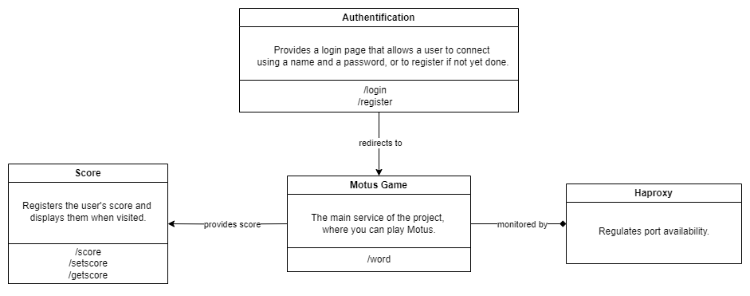
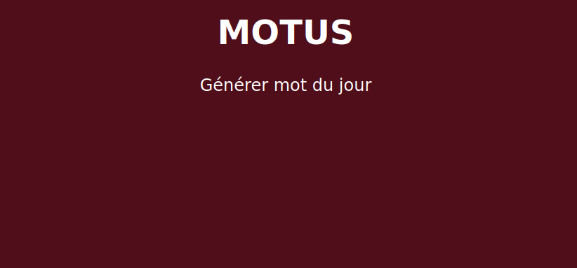
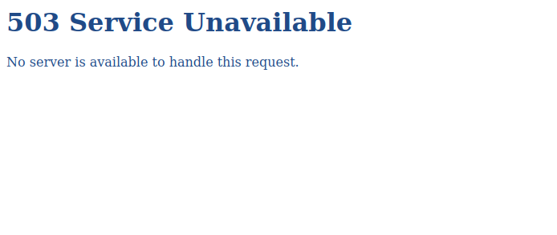
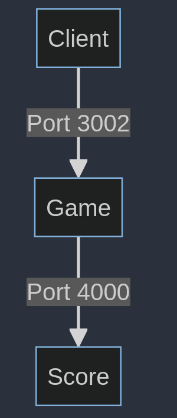

# motus
Projet de Microservices.

### First step to create the motus game using nodeJS
In ```game/data```, run ```nodejs app``` in the terminal.

## State of the Project

The project currently contains a functional Motus game, with a scoring system included. There is also a page allowing the user to register and login accordingly. The project also contains a working example of usage of Haproxy.

## Services Diagram


## Haproxy

### This section is just to understand how to use haproxy

- Create two servers on port 3000 and 4000 by running nodejs app in the folder ```port```.
- 
- Copy and paste the haproxy.cfg into ```etc/haproxy``` and then run ```sudo systemctl restart haproxy``` in the CLI, now the API can also be opened on port 3001.
- We set weight of 3 on port 3000 and weight 1 on port 4000.
- 
- Then if you just run the port 3000, the port 3001 has a 75% chance to serve the motus app and 25% chance to not find the server.

Here is what the windows look like if the server is load on port 3000 :



Here is what the windows look like if the server is load on port 4000 :



## Score

IN this section, the game is on data (port 3002) and the score section is on score (4000)



## Authentification

In this section 
